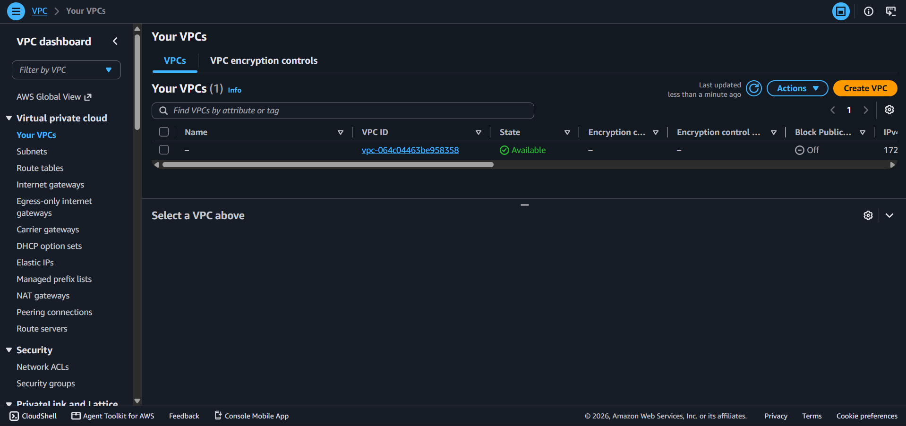
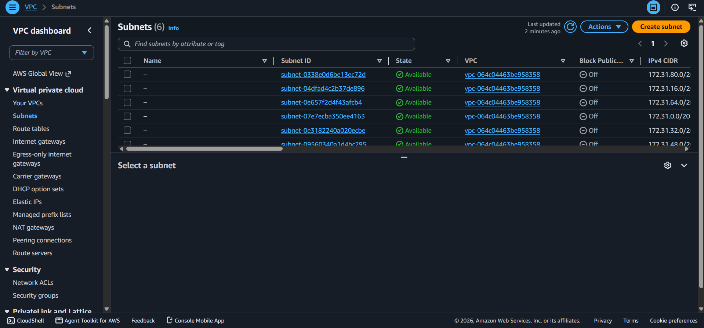
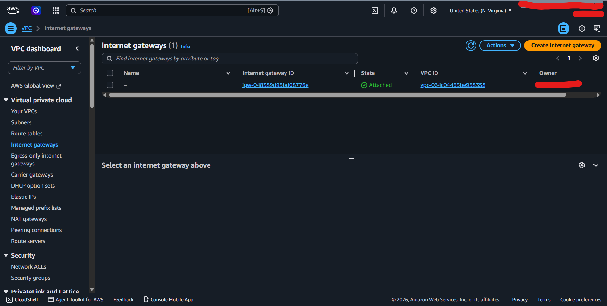
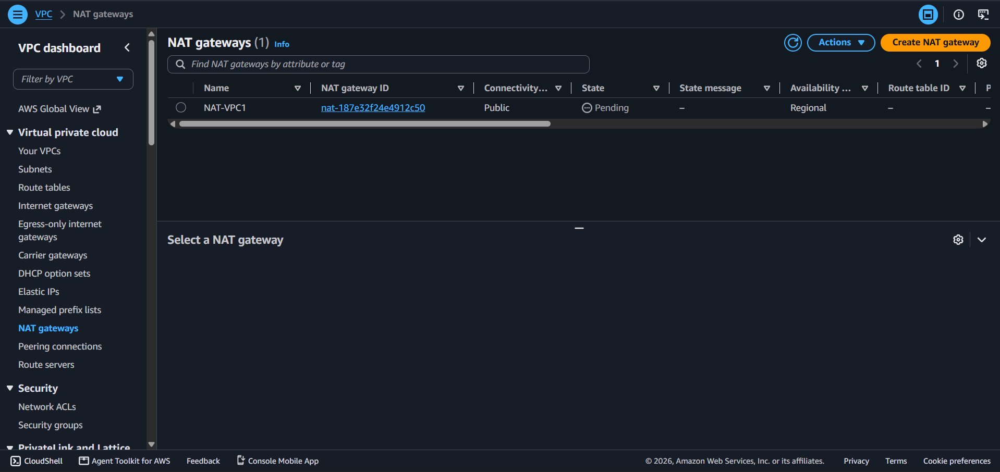
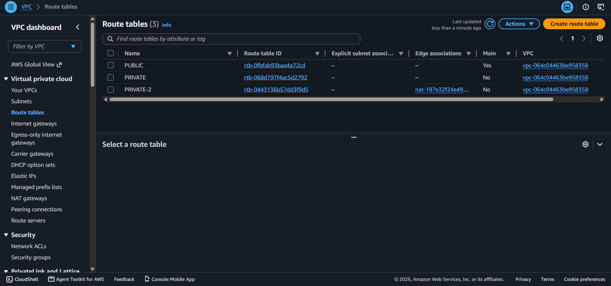
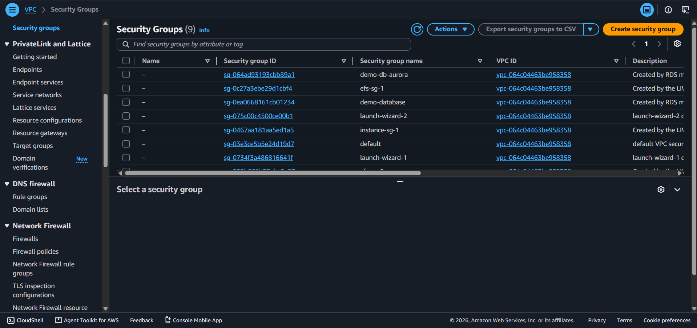
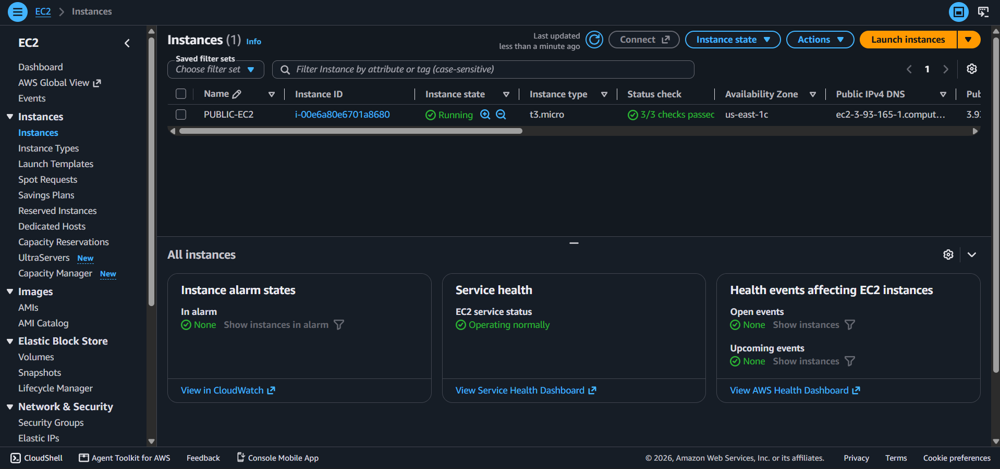

# Lab 2 — Build Your Amazon VPC Infrastructure

## 📌 Project Overview
This project demonstrates the design and deployment of a secure two-tier AWS VPC architecture. The objective is to deploy a private EC2 instance into a private subnet and connect to it securely using AWS Systems Manager (SSM) Session Manager, ensuring outbound internet access via a NAT Gateway without direct inbound access from the public internet.

---

## 🏗️ Architecture & Tasks

### Task 01: Create the VPC
- Created a custom VPC with CIDR `10.0.0.0/16`.
- Enabled DNS hostnames and DNS resolution.

---

### Task 02: Create Four Subnets
- Provisioned 4 subnets (`/24` CIDR blocks) across 2 Availability Zones:
  - 2 Public Subnets
  - 2 Private Subnets

---

### Task 03: Attach an Internet Gateway
- Attached an Internet Gateway (IGW) to the VPC.
- Configured the public route table with `0.0.0.0/0 -> IGW`.

---

### Task 04: Deploy a NAT Gateway
- Deployed a NAT Gateway inside a public subnet.
- Updated the private route table with `0.0.0.0/0 -> NAT Gateway` to allow secure outbound internet access.

---

### Task 05: Build Security Groups
- `sg-alb`: Configured to allow HTTPS (Port 443) from anywhere (`0.0.0.0/0`).
- `sg-app`: Configured to allow traffic on Port 8080 restricted exclusively from `sg-alb`.

---

### Task 06: Launch and Verify
- Launched an EC2 instance into the Private Subnet.
- Connected via AWS Systems Manager (SSM) Session Manager.
- Verified outbound connectivity via `curl` to prove outbound works while direct inbound is impossible.

---

## 🛠️️ Key Takeaways
- Outbound internet access works seamlessly through the NAT Gateway.
- Direct inbound access from the internet is completely blocked, ensuring high security.